# GOOGLE CLOUD COMPUTING : PROJECT
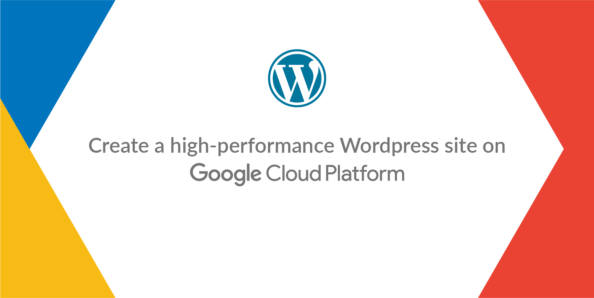

> This project is a part of my 2 Days GCP Workshop under the mentorship of **Mr. Vimal Daga**

# What is GCP 


Google Cloud Platform is a set of Computing, Networking, Storage, Big Data, Machine Learning and Management services provided by Google that runs on the same Cloud infrastructure that Google uses internally for its end-user products, such as Google Search, Gmail, Google Photos and YouTube.

# TASK DESCRIPTION
1. Create a Project
2. Create separate *VPC*
    1. for Wprdpress
    2. For MySQL
3. Link both VPCs using *VPC Peering*
4. Create *Kubernetes Cluster* in developer project and launch Wordpress with the Load balancer
5. Create *SQL server* in the production project and create a MYSQL database
6. Connect the SQL database to the web application launched in the Kubernetes cluster

# Prerequisites
- [x] Terraform installed.
- [x] kubectl must be installed and configured
- [x] Gcloud must be installed


# 1. Creating Project :
To Create any kind of Infrastructure on GCP, we have to build it under a project.
Just give any Name and check the Project ID and **CREATE**

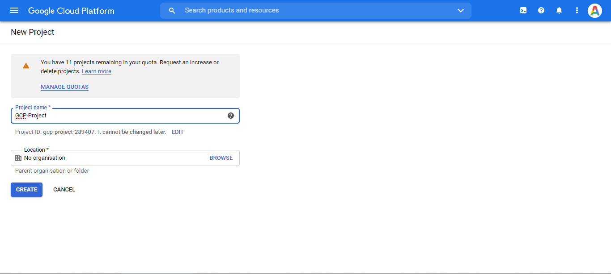

## Confirmation :
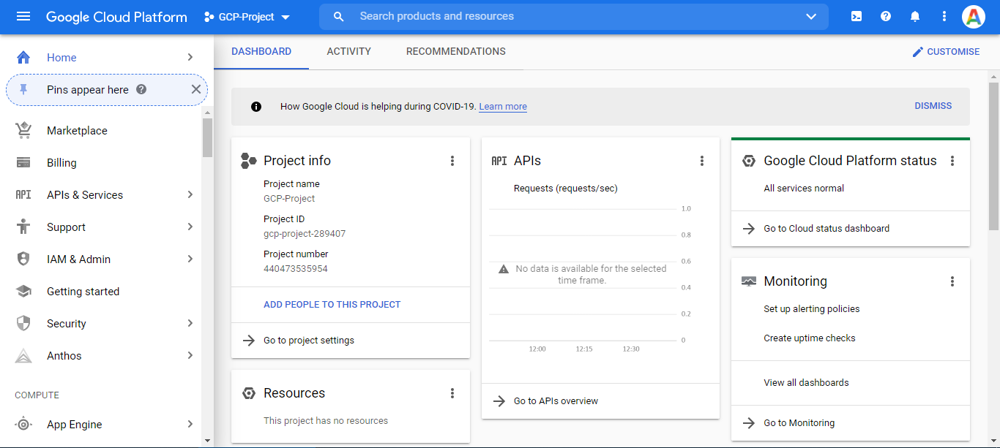

# 2. Creating 2 Virtual Private Networks (VPC)  :
First for WordPress deployment and second for MySQL Database.
Each VPC will have 1 subnet along with firewall rule for Ingress traffic

## 1. Firewall Rule

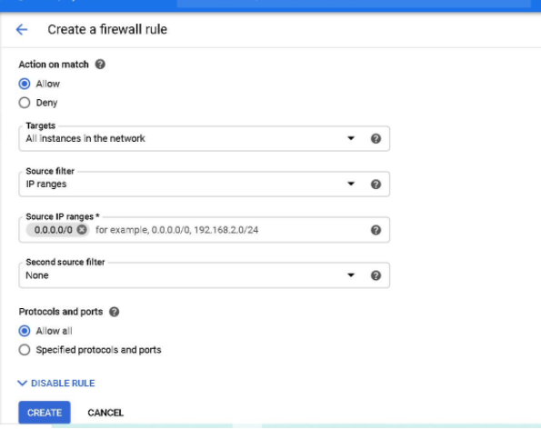

## 2. VPC and Subnet for Wordpress and MySql
- [x] **VPC-1 and Subnet-1**

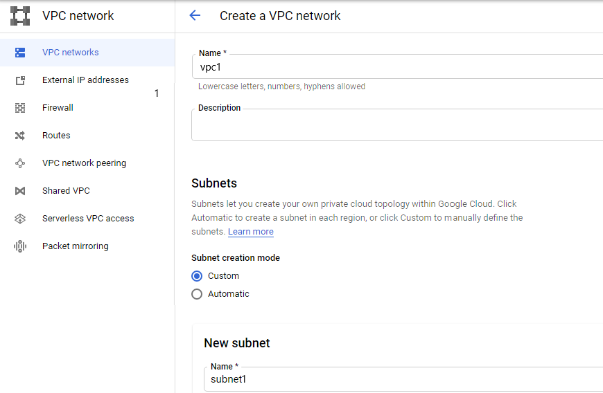

- [x] **VPC-2 and Subnet-2**


**Confirm**

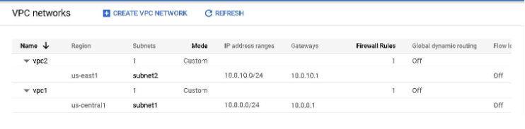

# 3. Linking both the VPC networks using VPC Peering:
- VPC Peering service of GCP for connecting these VPCs
- Individual peers are to be created for both the VPCs

**1. For VPC-1**

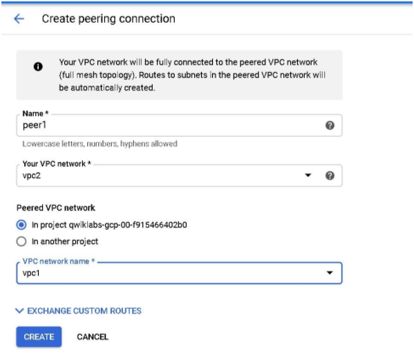

**1. For VPC-2**

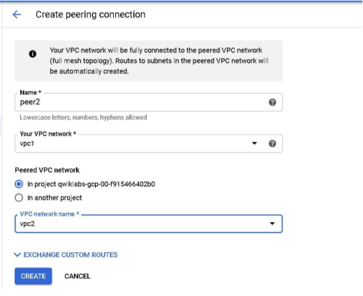


# 4. Create *Kubernetes Cluster* in developer project and launch any web application with the Load balancer
We will Configure a **Kubernetes Cluster** using the *GKE* service of GCP

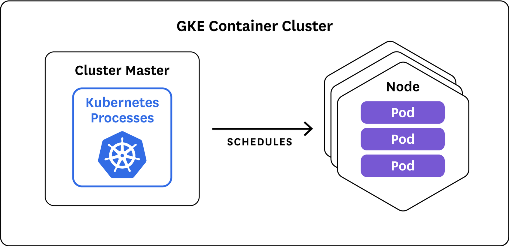
## K8s cluster in Wordpress VPC
***Specifications in NodePool:***
- [x] **VPC Name:** vpc1
- [x] **subnet** subnet1

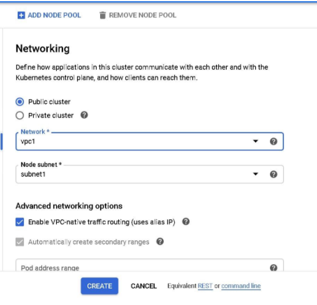

- [x] **Cluster Name:** cluster
- [x] **Region:** us-central-1
- [x] **Default Node Locations:**

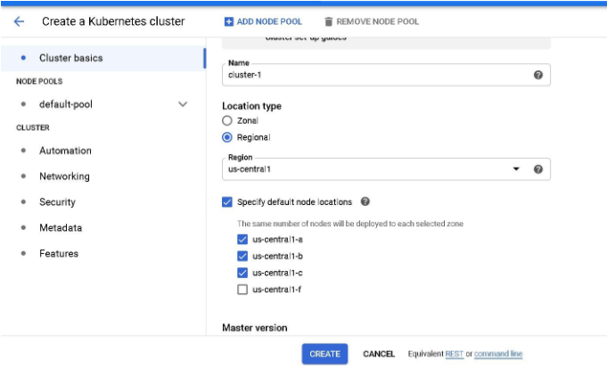

- [x] **Default Node Locations:**
- [x] **Nodes per-zone:** 1
- [x] **Total Nodes:** 3


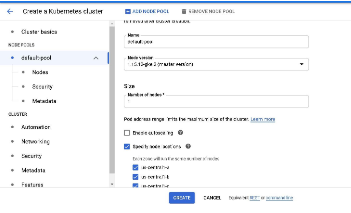

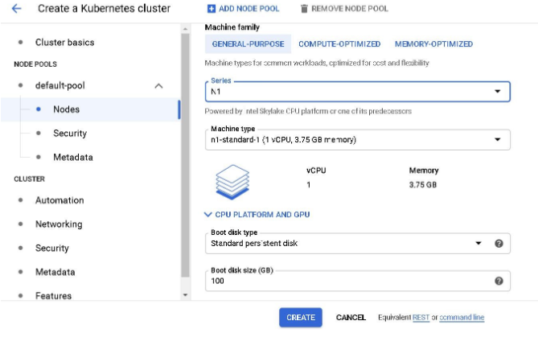

## Deploying Wordpress In Kubernetes CLuster

***1. Log in to GCP from Laptopusing Google Cloud SDK :***

```
gcloud auth login
gcloud project list
```

***2. Kubectl to access the Kubernetes Cluster***

Check the existing nodes : 
```
kubectl get nodes 
```
Create a deployment for Wordpress:
```
kubectl create deployment wp --image=wordpress
```
**Load balancer** to Expose Wordpress Deployment
```
kubectl expose deployment wp --type=LoadBalancer --port=80
```
Verify the setup :

```
kubectl get services
kubectl get all
```

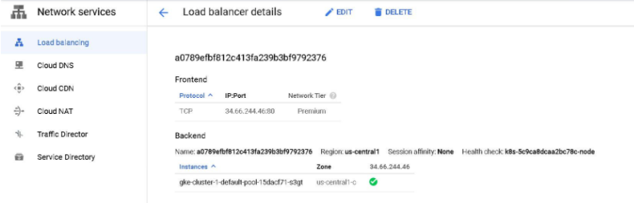


# 5. Launch MySQL Database instance using SQL service of GCP

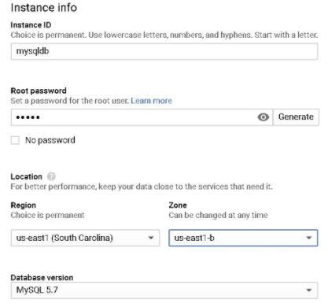

## Adding authorized network to public ip of MySQL Instance :

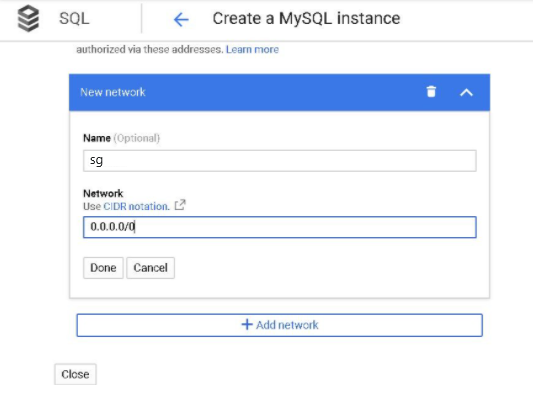

**Log in to MySQL Instance to see available databases :**
```
mysql -h <public IP> -u <username> -p
```

# Creating new database

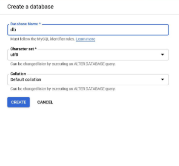

***Connect to  WordPress application to with MySQL Database Using public IP of load balancer.***

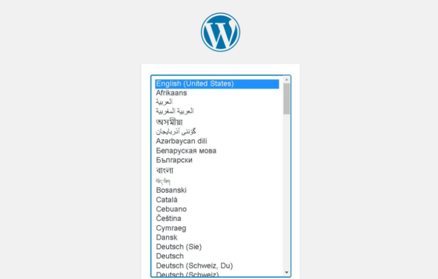

💯💯***SO, FINALLY, WE HAVE CREATED AN INFRACTURE PURELY USING THE SERVICES OF GCP TO DEPLOY A WEB APPLICATION WITH KUBERNETES DEPLOYMENT AND MYSQL DATABASE AT BACKEND !!!!***
